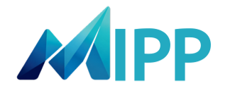
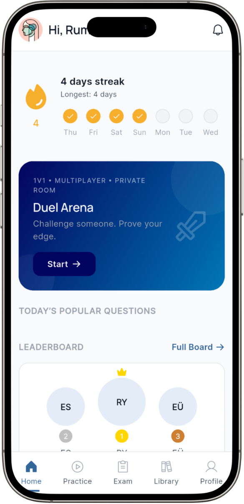
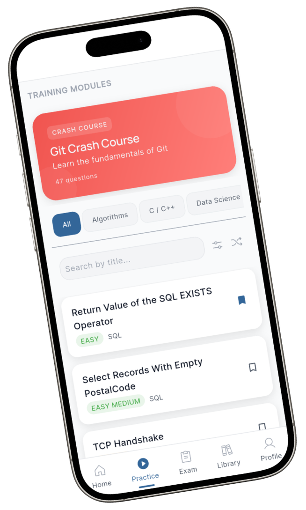
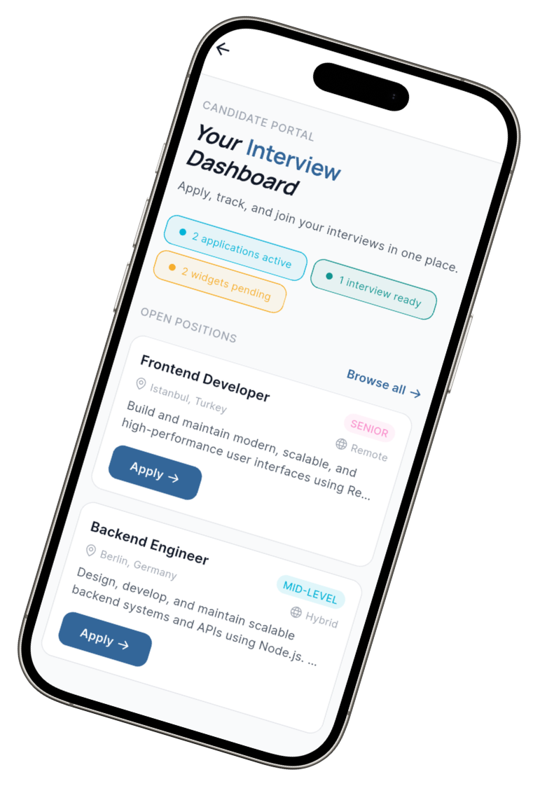

<div align="center">



# MIPP

### AI-Powered Interview Preparation & Recruitment Ecosystem

*One platform. Two sides. Infinite possibilities.*

---

[](https://flutter.dev)
[](https://dart.dev)
[](https://firebase.google.com)
[](https://deepmind.google/technologies/gemini/)
[](https://bigg.org.tr)
[](https://flutter.dev)
[](./LICENSE)

<br />

[Live Demo](#demo) · [Features](#features) · [Tech Stack](#tech-stack) · [Team](#team) · [Installation](#installation)

</div>

---

## What is MIPP?

MIPP is a cross-platform mobile application that unifies technical interview preparation and intelligent recruitment management into a single, AI-powered ecosystem.

On one side, candidates practice coding, answer AI-evaluated questions, compete in real-time technical duels, and attend structured AI-assisted interviews. On the other, HR teams manage job postings, schedule interviews, and rank candidates through an intelligent dashboard — all inside the same platform.

> Accepted into **TÜBİTAK BİGG Stage 1** — the national entrepreneurship support program for technology startups.
> Developed at **Ankara Yıldırım Beyazıt University, Department of Computer Engineering**.

---

## Platform Overview

<div align="center">



</div>

<br />

MIPP operates as two integrated products sharing a single backend:

| Side | Who | Purpose |
|---|---|---|
| **Candidate App** | Developers, students, job seekers | Practice · Compete · Get interviewed |
| **HR Platform** | Recruiters, hiring managers | Post jobs · Schedule · Rank candidates |

---

## Features

### Adaptive AI-Powered Practice

Candidates improve their technical skills through a structured, AI-assisted practice environment with four question formats and instant feedback.

<div align="center">



</div>

- Multiple Choice Questions
- Coding Challenges
- Fill in the Blank
- Short Answer
- **WHY? Analysis System** — AI explains every answer in depth, not just marks it right or wrong
- Topic-based progress tracking
- Per-topic performance reports
- AI-generated module explanations

---

### Real-Time Multiplayer Duel System

Compete against other candidates in live, timed technical battles. The duel system is built on real-time Firebase listeners for zero-latency scoring.

- Live 1v1 matchmaking
- Private room system (invite by code)
- Simultaneous question delivery
- Real-time score updates
- XP rewards on win/loss
- Global leaderboard ranking

---

### AI-Assisted Technical Interviews

<div align="center">



</div>

Candidates join real company hiring flows directly through MIPP:

- Interview invitations via in-app notifications
- Secure waiting room before session start
- Live technical assessments under timed conditions
- AI-powered answer evaluation
- Submission tracking and feedback delivery
- Full interview history

---

### Intelligent HR Platform

Recruiters get a dedicated interface to manage the full hiring pipeline:

- Job posting creation and management
- Candidate pool overview
- AI-assisted ranking by technical performance
- Interview scheduling and calendar management
- Per-candidate analytics and evaluation reports
- Technical competency dashboards

---

### Gamification & Learning Hub

The home dashboard keeps candidates engaged through a progression system:

- XP points for every activity
- Activity streaks (daily login rewards)
- Daily challenge rotation
- Global leaderboard (top 3 highlighted)
- Achievement milestones

---

## AI Systems

MIPP integrates multiple AI layers:

| System | Technology | Function |
|---|---|---|
| WHY? Explanation Engine | Gemini API | Explains correct answers in plain language |
| Answer Evaluation | OpenAI / Gemini | Scores free-text and coding responses |
| Candidate Ranking | Custom scoring model | Ranks candidates by technical performance |
| NLP Analysis | LLM integration | Analyzes short-answer and coding quality |

The AI layer is modular — each system can be updated or replaced independently without touching the Flutter codebase.

---

## Architecture Overview

```
┌─────────────────────────────────────────────────────────┐
│                     Flutter Client                       │
│          Candidate App       HR Platform                 │
│               GetX State Management                      │
└──────────────────────┬──────────────────────────────────┘
                       │
          ┌────────────▼────────────┐
          │     Firebase Layer      │
          │  Firestore  │  Auth     │
          │  Realtime DB (Duels)    │
          └────────────┬────────────┘
                       │
          ┌────────────▼────────────┐
          │       AI Services       │
          │  Gemini API │ OpenAI    │
          │  Custom Evaluation      │
          └─────────────────────────┘
```

- **State management:** GetX (controllers, dependency injection, routing)
- **Real-time:** Firestore streams for duel synchronization and live scoring
- **Auth:** Firebase Authentication (email, OAuth)
- **Storage:** Firestore collections per domain (users, questions, duels, jobs, interviews)
- **AI calls:** Isolated service layer, callable from any controller

---

## Tech Stack

<div align="center">

| Layer | Technology |
|---|---|
| Mobile Framework | Flutter 3.x |
| Language | Dart 3.x |
| State Management | GetX |
| Database | Cloud Firestore |
| Authentication | Firebase Auth |
| Realtime | Firebase Realtime DB |
| AI — Explanations | Gemini API |
| AI — Evaluation | OpenAI API |
| Platform | iOS · Android |

</div>

---

## Screenshots

### Home & Dashboard

<div align="center">


</div>

### Practice System

<div align="center">


</div>

### Interview Flow

<div align="center">


</div>

---

## Installation

### Prerequisites

- Flutter SDK `>=3.0.0`
- Dart SDK `>=3.0.0`
- Firebase project (Firestore + Auth enabled)
- Gemini API key
- OpenAI API key (optional)

### Setup

```bash
# Clone the repository
git clone https://tinyurl.com/mipp-team6
cd mipp

# Install dependencies
flutter pub get

# Configure Firebase
# Place your google-services.json (Android) and GoogleService-Info.plist (iOS)
# in the respective platform directories

# Set up environment variables
cp .env.example .env
# Fill in your API keys in .env

# Run on device
flutter run
```

### Environment Variables

```env
GEMINI_API_KEY=your_gemini_key_here
OPENAI_API_KEY=your_openai_key_here
```

---

## Project Structure

```
lib/
├── core/
│   ├── constants/
│   ├── theme/
│   └── utils/
├── data/
│   ├── models/
│   ├── repositories/
│   └── services/
│       ├── ai/
│       ├── auth/
│       └── firebase/
├── modules/
│   ├── auth/
│   ├── home/
│   ├── practice/
│   ├── duel/
│   ├── interview/
│   ├── hr/
│   └── leaderboard/
└── main.dart
```

---

## Future Plans

- [ ] Web platform support (Flutter Web)
- [ ] Voice-based interview simulation
- [ ] Resume parsing and AI matching
- [ ] Company profile pages
- [ ] Push notification system (interview reminders, duel invites)
- [ ] Advanced analytics dashboard for HR
- [ ] Expanded question bank (1000+ → 5000+)
- [ ] Team duel mode (3v3)
- [ ] Offline practice mode

---

## Team

<div align="center">

| | Name | Role |
|---|---|---|
| **RY** | Rümeysa Yavuzkanat | Lead Developer · System Architecture · Frontend Engineering · UI/UX |
| **ES** | Emine Sena Top | Backend Architecture · Firebase · Firestore |
| **EÜ** | Ege Ündeniş | AI Systems · LLM Integration · AI Evaluation Infrastructure |

</div>

<br />

**Supervisor**

> **Prof. Dr. M. Fatih Demirci**
> Head of Department, Computer Engineering
> Ankara Yıldırım Beyazıt University

---

## Recognition

- **TÜBİTAK BİGG Stage 1** — Accepted (National Entrepreneurship Program)
- **AYBU Computer Engineering Capstone** — Graduation project
- **BİGGGARAJ** — Incubation program participant

---

## License

```
MIT License

Copyright (c) 2025 MIPP Team — AYBU Computer Engineering

Permission is hereby granted, free of charge, to any person obtaining a copy
of this software and associated documentation files (the "Software"), to deal
in the Software without restriction, including without limitation the rights
to use, copy, modify, merge, publish, distribute, sublicense, and/or sell
copies of the Software, and to permit persons to whom the Software is
furnished to do so, subject to the following conditions:

The above copyright notice and this permission notice shall be included in all
copies or substantial portions of the Software.
```

---

<div align="center">

**MIPP** · AYBU Computer Engineering · 2025

[tinyurl.com/mipp-team6](https://tinyurl.com/mipp-team6)

</div>
